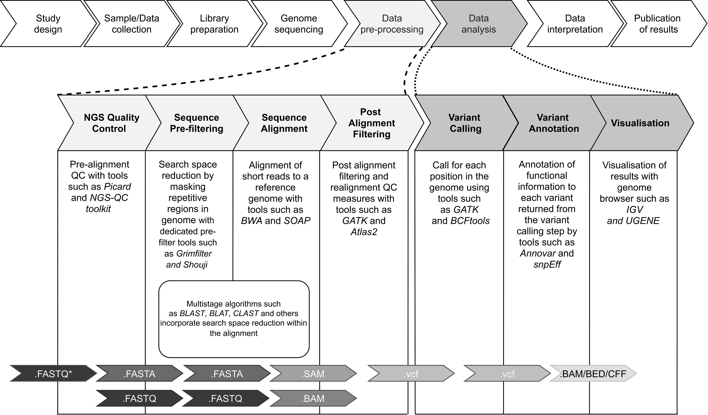

## Something you should Know

### 🐸🦄🐾🐈🐇🐬🐠🦉🎈🎊🎀🎀🎀🎄🧸🍕🍟🍙🍤🍨🍧🍦🍰🧁🍬🍓🍄🌸🍀❄⛄💕[Home](https://runjiaji.github.io/blog/)

### 组学分析
- [Fast_qc序列质控报告解读](https://www.jianshu.com/p/a1eb03d63083)

### Linux系统
- [Bash讲解](https://wangdoc.com/bash/intro.html)

- [文件目录及颜色区分](https://blog.csdn.net/superhoy/article/details/52611452)

### 编辑器
- [Vim](https://www.vpser.net/manage/vi.html)

- [Markdown](https://markdown.com.cn/)

### 数据库
- [宏基因组组装数据库](https://genome.jgi.doe.gov/GEMs)   [参考文献](https://escholarship.org/content/qt42k112z2/qt42k112z2.pdf)

### 网站教程
- [W3Cschool](https://www.w3schools.com/)

- [菜鸟教程](https://www.runoob.com/)

- [cheat_sheet](https://simplecheatsheet.com/)

### 学术期刊
- [Bioinformatics](https://academic.oup.com/bioinformatics/)

- [bioRxiv](https://www.biorxiv.org/)

### 分子生物钟工具
- [PhyloBayes](https://hpc.nih.gov/apps/PhyloBayes.html#doc)   [github](https://github.com/bayesiancook/phylobayes/)

### Package Release
- [Pypi package](https://packaging.python.org/tutorials/packaging-projects/)

### 其他语言
- [***Perl***](https://www.perl.org/)

#### 捏吗的碎碎念
- ***Python***
  - getattr返回某个对象的某个属性
  - raise用来写报错信息

- ***Prokka***
  - tbl2asn报错的话就手动下载然后安装 [link](https://www.ncbi.nlm.nih.gov/genbank/tbl2asn2/)

- ***Molecular Clock***
  - Bayes

- ***Bioinformatics intro***
  - [Bioinfromatics_2021intro](src/Bioinformatics_introduction_2021.pdf)
  - Typical bioinformatics pipeline
 
